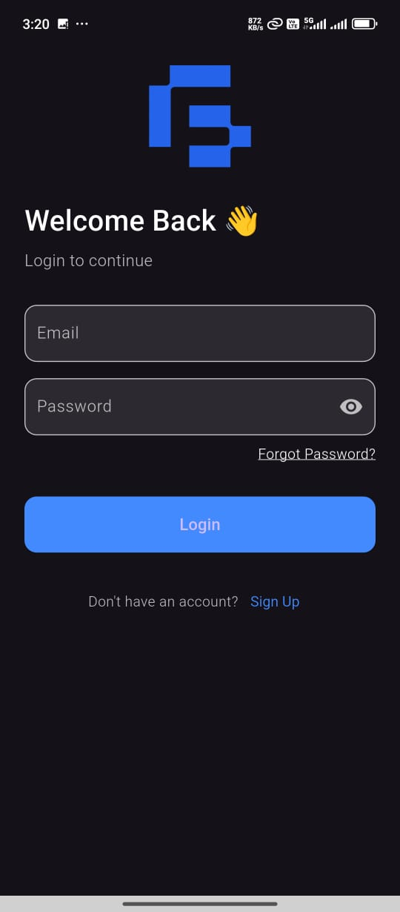
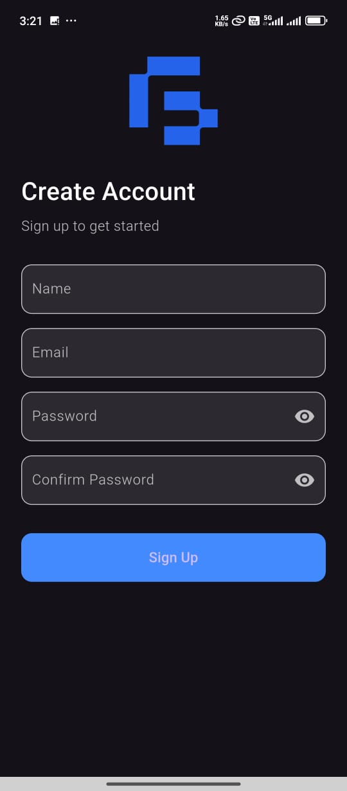
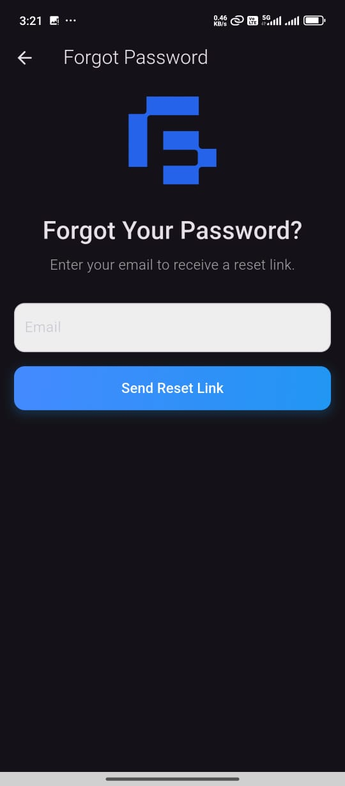
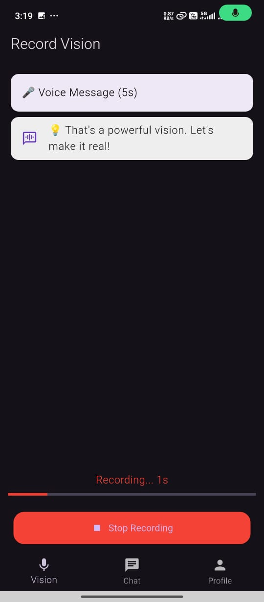
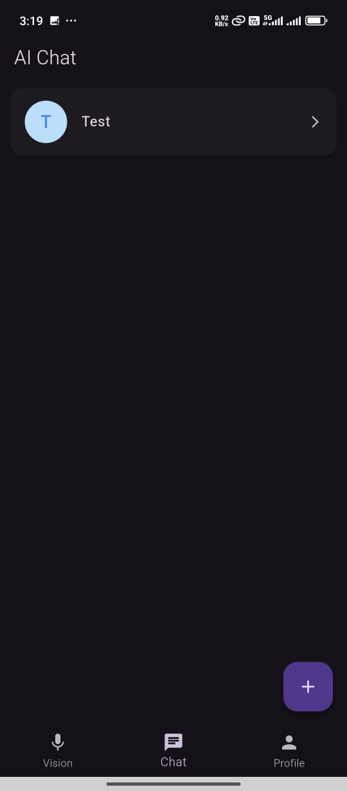
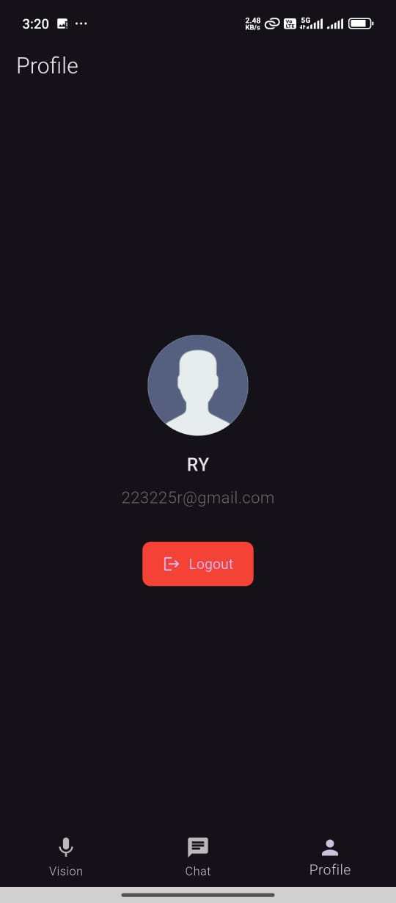
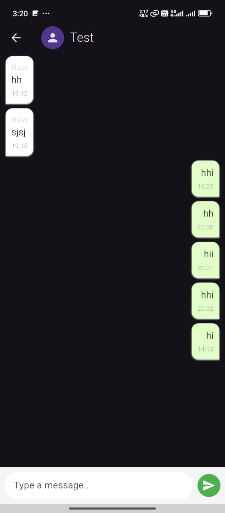

# 📰 Gaia AI App

A clean and intuitive Flutter app that replicates key features of the Gaia AI platform, including authentication, vision recording, and AI-driven chat. Built with a focus on modularity and smooth user experience, using Firebase for authentication and a mock API for AI interactions.

---

## ✨ Features

- 🔐 User Authentication: Sign up, login, and email verification with Firebase Auth
- 🎙️ Vision Recording: Record a short voice message (30–60 seconds) and simulate sending to an AI
- 💬 AI Chat: Chat interface with multiple rooms and AI-generated responses (mock API)
- 🎧 Playback: Playback recorded voice messages
- 🌊 Audio Visualization: (Bonus) Visualize the audio waveform and smooth transitions
- 🌐 Responsive Design: Mobile-friendly UI, inspired by Gaia AI's web app style
- 🔄 Error Handling: Graceful error handling for authentication and chat features
- ⏳ Loading Indicators: Show loading spinners and smooth UI transitions
- 📶 Offline Persistence: (Bonus) Caching of data and offline support using local storage or SQLite

---

## 🚀 Setup Instructions

1. **Clone the repository**:
   ```bash
   git https://github.com/RaviYadavO4/gaia_ai.git
   cd gaia_ai

2. **Install dependencies:**

- provider: ^6.1.5
- firebase_core: ^3.13.0
- firebase_auth: ^5.5.3
- shared_preferences: ^2.5.3
- uuid: ^4.5.1
- path_provider: ^2.1.5
- just_audio: ^0.10.2
- flutter_sound: ^9.28.0
- permission_handler: ^12.0.0+1
- lutter_spinkit: ^5.2.1
- audioplayers: ^6.4.0
- cloud_firestore: ^5.6.7
- intl: ^0.20.2
- flutter_launcher_icons: ^0.14.3

3. **Run the app**
- flutter run


## 🛠️ Tech Stack
- Tool/Library	    Purpose
- Flutter SDK 3+	Mobile UI Framework
- Provider	        State Management
- firebase_core	        Firebase initialization
- firebase_auth	User    authentication via Firebase
- shared_preferences	Local storage for simple data persistence
- uuid	                Generate unique identifiers
- path_provider	        Access device file system paths
- just_audio	        Audio playback support
- flutter_sound	        Audio recording and playback
- permission_handler	Handle device permissions (microphone, storage, etc.)
- flutter_spinkit	    Show loading spinners and animations
- audioplayers	        Audio playback library
- cloud_firestore	    Cloud database for storing user data and chat history
- intl	                Internationalization and date formatting
- flutter_launcher_icons	Custom app icons for Android and iOS

## 🧠 State Management Explanation

The app uses Provider with ChangeNotifier to manage various aspects of the application state. The AuthProvider handles user authentication, including sign-up, login, email verification, and password reset. The ChatProvider manages real-time chat functionality, fetching and sending messages via Firestore, and maintaining conversation history. The VoiceBotProvider manages voice recording, playback, and AI-generated responses, while also handling microphone permissions. Widgets subscribe to state changes using Consumer or Selector, ensuring efficient and real-time UI updates across authentication, chat, and voice interaction features.

## 📁 Folder Structure

```text
lib/
│
├── main.dart                      # App entry point
│
├── models/
│   ├── message.dart               # Message model for chat functionality
│   └── user.dart                  # User model for authentication and profile
│
├── services/
│   ├── firestore_service.dart     # Firestore service for managing chat data
│   ├── auth_service.dart          # Firebase authentication logic
│   └── voice_service.dart         # Audio recording and playback logic
│
├── providers/
│   ├── auth_provider.dart         # User authentication state management
│   ├── chat_provider.dart         # Real-time chat state management
│   └── voice_bot_provider.dart    # Voice recording and playback state management
│
├── screens/
│   ├── splash_screen.dart         # Initial splash screen
│   ├── auth_screen.dart           # Authentication (login/signup) UI
│   ├── chat_screen.dart           # Chat room UI
│   ├── voice_screen.dart          # Voice message recording and playback UI
│   └── home_screen.dart           # Main screen for app navigation
│
├── widgets/
│   ├── chat_bubble.dart           # UI widget for displaying chat messages
│   ├── custom_button.dart         # Reusable button widget
│   ├── message_input.dart         # Input field for chat messages
│   └── voice_player.dart          # UI widget for controlling voice playback
│
└── utils/
    └── constants.dart             # Constant values like API keys, etc.

```


## 📸 Screenshots

| 🏠 Login Screen                      | 🏠 Signup Screen                   |
|--------------------------------------|------------------------------------|
|  |  |
| **Login Screen**                     | **Signup Screen**                 |

| 🏠 Forgot Password Screen            | 🏠 Record Vision Screen            |
|--------------------------------------|------------------------------------|
|  |  |
| **Forgot Password Screen**           | **Record Vision Screen**          |

| 🔍 Chat Functionality                | 📄 Profile View                   |
|--------------------------------------|------------------------------------|
|  |  |
|  | **Profile View**                  |
| **Chat Functionality**               |                                    |


## 🎥 Video Walkthrough

Watch the video walkthrough for a detailed overview of the app:

[](https://youtube.com/shorts/_a_LWpaCfuQ)

## 📌 Author

**Ravi Yadav**  
🔗 [GitHub Profile](https://github.com/RaviYadavO4)